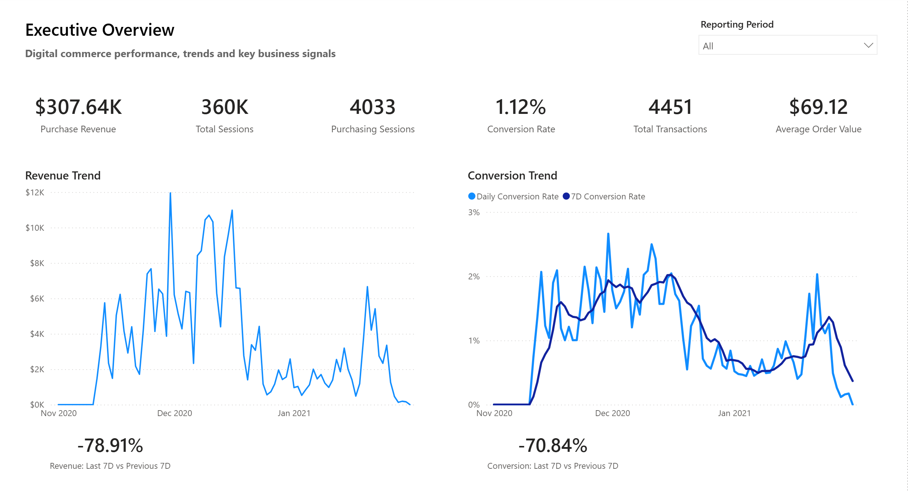
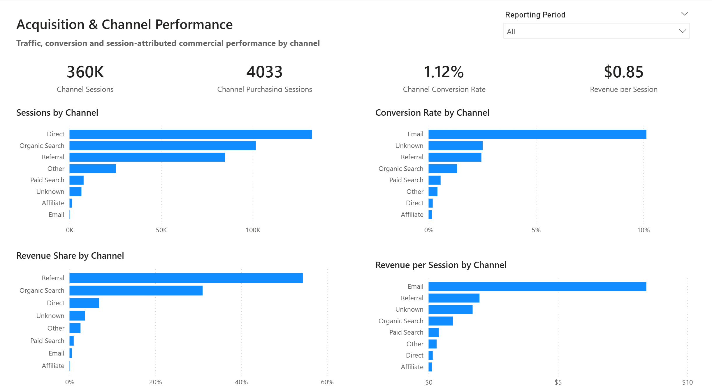
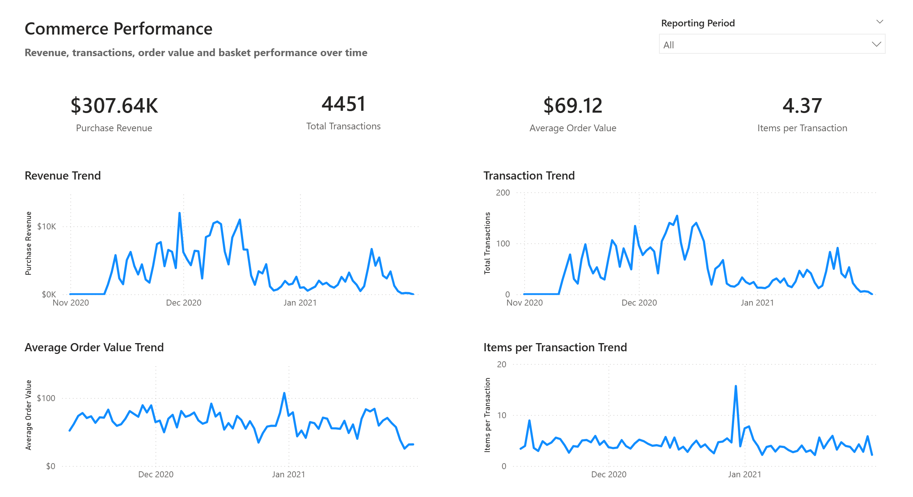
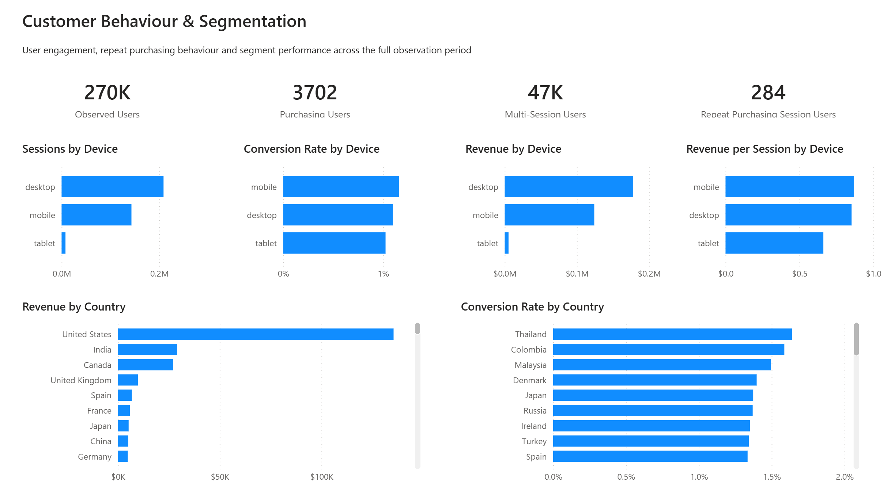

# Digital Commerce Performance Analytics

An end-to-end analytics engineering and business intelligence solution that transforms raw GA4 ecommerce event data into governed analytical models, validated business KPIs, and an executive Power BI reporting layer.

The project implements a production-oriented analytical workflow across **BigQuery, dbt Core, SQL, data quality testing, dimensional modeling, KPI governance, and Power BI**.

---

## Business Problem

Raw GA4 ecommerce data is event-based, nested, and not directly suitable for reliable commercial reporting. Metrics such as sessions, conversion, transactions, revenue, and customer behaviour can become inconsistent when session identity, purchase deduplication, attribution, analytical grain, and date semantics are not governed before reporting.

The project addresses a central business question:

> **How is digital commerce performance evolving, what is driving the results across acquisition, commerce, and customer segments, and where should decision-makers focus their attention?**

This question is broken into several analytical questions:

- How are revenue, transactions, conversion, and average order value changing over time?
- Which acquisition channels generate traffic, purchasing sessions, and session-attributed revenue?
- Which channels convert traffic more efficiently and contribute more strongly to commercial performance?
- Are changes in revenue primarily associated with traffic, conversion, transaction volume, or order value?
- How do observed-user behaviour and purchasing patterns differ across the available population?
- How does performance vary across device and geographic segments?
- Can the same governed KPI definitions be reconciled consistently from raw source data through the BI reporting layer?

The project therefore combines analytics engineering, KPI governance, validation, and business intelligence to create a trusted analytical foundation for investigating commercial performance.

---

## Solution Overview

The solution converts raw GA4 ecommerce events into a layered analytics architecture:

    GA4 Public Ecommerce Dataset
                |
                v
          BigQuery Source
                |
                v
           dbt Staging
                |
                v
        Intermediate Models
                |
                v
           Core Warehouse
         Dimensions + Facts
                |
                v
           Business Marts
                |
                v
        Executive KPI Layer
                |
                v
          BI Serving Layer
                |
                v
       Power BI Semantic Model
                |
                v
         Executive Reporting

Each layer has a defined analytical responsibility and grain.

Business logic is implemented upstream in dbt where possible, while Power BI consumes governed reporting-ready datasets.

The implemented architecture is documented in [`docs/architecture/target_architecture.md`](docs/architecture/target_architecture.md).

---

## Technology Stack

| Area | Technology |
|---|---|
| Cloud Data Warehouse | Google BigQuery |
| Transformation | dbt Core |
| Query Language | SQL |
| BI & Visualization | Power BI |
| Development | VS Code |
| Version Control | Git |
| Repository & Review Workflow | GitHub |

---

## Data Source

The project uses the public **Google Analytics 4 obfuscated ecommerce sample dataset** available in BigQuery:

`bigquery-public-data.ga4_obfuscated_sample_ecommerce`

Governed analytical window:

    2020-11-01 to 2021-01-31

The source contains **4,295,584 GA4 event rows** across **92 daily event tables** in the approved analytical window.

Because GA4 data is nested and event-based, the project explicitly handles:

- nested event parameters
- repeated item arrays
- session identity
- event sequencing
- transaction identity
- duplicate purchase events
- acquisition attributes
- channel classification
- observed user-level behavioural aggregation

No raw source data is stored in this repository.

---

## Analytical Architecture

### Staging

Source-aligned models extract and standardize GA4 event and item data while preserving source semantics.

Primary models:

- `stg_ga4__events`
- `stg_ga4__items`

### Intermediate

Reusable analytical entities establish deterministic session and transaction logic and prepare governed acquisition context for downstream modeling.

Primary models:

- `int_ga4__session_events`
- `int_ga4__sessions`
- `int_ga4__transactions`

### Core Warehouse

The warehouse layer exposes governed reusable dimensions and facts.

Primary models:

- `dim_date`
- `dim_channel`
- `fct_sessions`
- `fct_transactions`

### Business Marts

Business-facing marts provide stable analytical grains for reporting and investigation.

Primary models:

- `mart_channel_daily`
- `mart_ecommerce_daily`
- `mart_segment_daily`
- `mart_user_behavior`

The segmentation mart is modeled at `date × device_category × country` grain and intentionally does not expose additive user metrics.

### Executive KPI Layer

Executive models provide governed KPI bases, trends, and performance drivers.

They separate session-date, transaction-date, and session-cohort semantics to prevent invalid aggregation.

### BI Serving Layer

Thin reporting views expose approved datasets to Power BI without introducing new business logic.

Primary models:

- `bi_channel_daily`
- `bi_commerce_daily`
- `bi_executive_daily`
- `bi_segment_daily`
- `bi_user_behavior`

---

## Governed KPI Framework

The project defines KPI formulas and aggregation rules upstream rather than relying on ad hoc dashboard calculations.

Core executive metrics include:

| KPI | Governed Definition |
|---|---|
| Sessions | Governed session count |
| Purchasing Sessions | Sessions containing at least one governed purchase |
| Conversion Rate | Purchasing Sessions / Sessions |
| Transactions | Governed valid transaction count |
| Purchase Revenue | Governed transaction-date purchase revenue |
| Average Order Value | Purchase Revenue / Transactions |
| Revenue per Session | Session-attributed Purchase Revenue / Sessions |

Ratio metrics are recalculated from their additive components when reporting across periods. Daily ratios are not averaged.

Detailed KPI definitions are maintained in [`digital_commerce_performance_analytics/docs/business_requirements/executive_kpi_reference.md`](digital_commerce_performance_analytics/docs/business_requirements/executive_kpi_reference.md).

---

## Validated Analytical Baseline

Final end-to-end reconciliation produced the following governed baseline:

| Metric | Validated Value |
|---|---:|
| Sessions | 360,129 |
| Purchasing Sessions | 4,033 |
| Conversion Rate | 1.12% |
| Transactions | 4,451 |
| Purchase Revenue | $307,640 |
| Average Order Value | $69.12 |
| Observed Users | 270,154 |
| Purchasing Users | 3,702 |
| Multi-Session Users | 47,364 |
| Repeat Purchasing-Session Users | 284 |

These populations and commercial metrics were reconciled across the analytical warehouse and BI serving layers before final report acceptance.

---

## Analytical Findings & Business Decision Support

The governed analytical baseline establishes a consistent view of digital commerce performance across the approved 92-day period.

Key findings from the implemented solution include:

- **360,129 sessions generated 4,451 governed transactions and $307,640 in purchase revenue**, establishing the reconciled commercial baseline for the reporting period.
- **4,033 sessions contained at least one governed purchase**, resulting in a session conversion rate of **1.12%**.
- Average order value was **$69.12**, allowing revenue changes to be investigated separately through transaction volume and order-value effects.
- Traffic was concentrated primarily in **Direct, Organic Search, and Referral**, while the governed channel layer makes conversion, revenue contribution, and revenue-per-session differences comparable across acquisition channels.
- **270,154 observed users** were represented in the governed user-level analytical population, including **47,364 multi-session users** and **3,702 purchasing users**.
- Device-level analysis showed broadly similar conversion rates across desktop and mobile traffic, while tablet represented a substantially smaller traffic and revenue population.
- The analytical model separates session-date, transaction-date, and session-cohort semantics, allowing performance changes to be investigated without mixing incompatible metric populations.

### Business Decision Support

The project does not claim a measured commercial uplift because the source is a static public dataset and no business intervention was deployed.

Instead, the delivered analytics solution provides a governed decision-support framework that enables business teams to:

- monitor revenue, conversion, transaction volume, and average order value consistently;
- distinguish whether performance changes are associated with traffic, conversion, transaction volume, or order value;
- compare acquisition channels using governed traffic, conversion, revenue contribution, and revenue-per-session metrics;
- identify channel or segment performance differences that warrant deeper investigation;
- investigate observed-user purchasing and repeat-session behaviour;
- compare device and geographic performance without violating analytical grain;
- trace executive KPIs back through governed analytical models and reconciliation controls.

The business value of the project is therefore not an assumed revenue uplift, but the creation of a **trusted and reproducible analytical system for diagnosing ecommerce performance and supporting evidence-based commercial decisions**.

---

## Power BI Report

The final Power BI report contains four analytical pages.

### 1. Executive Overview

Provides leadership-level visibility into:

- revenue
- sessions
- purchasing sessions
- conversion rate
- transactions
- average order value
- revenue and conversion trends
- recent performance changes

### 2. Acquisition & Channel Performance

Examines:

- session volume by channel
- purchasing sessions
- channel conversion
- revenue contribution
- revenue per session
- channel performance differences

### 3. Commerce Performance

Focuses on:

- purchase revenue
- transactions
- average order value
- items per transaction
- commercial trends and anomalies

### 4. Customer Behaviour & Segmentation

Examines:

- observed users
- purchasing users
- multi-session users
- repeat purchasing-session behaviour
- device performance
- geographic and behavioural segmentation

The report follows the analytical path:

**Overall Performance → Acquisition Drivers → Commerce Drivers → User & Segment Investigation**

The canonical Power BI file is:

`power_bi/digital_commerce_performance_analytics.pbix`

Detailed report documentation is available in [`power_bi/documentation/`](power_bi/documentation/).

---

## Data Quality and Validation

Data quality is treated as part of the analytical architecture rather than as a final manual check.

Validation includes:

- grain and uniqueness controls
- non-null and accepted-value tests
- referential-integrity checks
- source-to-staging reconciliation
- intermediate-to-core reconciliation
- business-mart reconciliation
- BI-serving reconciliation
- transaction and revenue validation
- session and purchase consistency
- date-boundary controls
- manual analytical QA
- Power BI regression checks

The final release dbt quality gate completed successfully with:

    13 table models
    8 view models
    367 data tests
    388 total selected resources

    PASS=388
    WARN=0
    ERROR=0
    SKIP=0
    TOTAL=388

Historical validation evidence is retained by delivery phase, so earlier validation reports preserve the test counts that were valid at those checkpoints.

Validation methodology and evidence are documented in [`validation/README.md`](validation/README.md).

---

## Key Engineering Decisions

Several design decisions protect analytical correctness.

**Deterministic session identity**

GA4 session parameters are transformed into governed session entities before business aggregation.

**Transaction deduplication**

Purchase events are normalized and deduplicated before transaction-level revenue is exposed.

**Explicit analytical grains**

Session, transaction, observed-user, daily-channel, daily-segment, and executive reporting grains remain separate.

**Governed channel attribution**

Acquisition signals are normalized into a controlled business-facing channel dimension instead of exposing raw GA4 acquisition values directly to BI.

**Semantic separation of dates**

Session-date, transaction-date, and session-cohort measures remain distinguishable to prevent invalid KPI combinations.

**Thin BI serving layer**

Power BI receives stable reporting interfaces while core business logic remains governed upstream.

**Reconciliation as a design requirement**

Major populations and commercial metrics must reconcile between analytical layers before downstream acceptance.

---

## Repository Structure

    .
    |-- digital_commerce_performance_analytics/
    |   |-- models/
    |   |   |-- staging/
    |   |   |-- intermediate/
    |   |   `-- marts/
    |   |       |-- core/
    |   |       |-- business/
    |   |       |-- executive/
    |   |       `-- serving/
    |   |-- tests/
    |   |-- macros/
    |   |-- docs/
    |   |-- dbt_project.yml
    |   `-- README.md
    |-- docs/
    |   |-- architecture/
    |   |   `-- assets/
    |   |-- data_quality/
    |   |-- decisions/
    |   `-- project_management/
    |-- power_bi/
    |   |-- assets/
    |   |-- documentation/
    |   `-- digital_commerce_performance_analytics.pbix
    |-- validation/
    |   |-- phase_4/
    |   |-- phase_5/
    |   `-- reports/
    |-- CONTRIBUTING.md
    |-- README.md
    `-- requirements.txt

---

## Documentation

Detailed project documentation is maintained alongside the implementation.

Key documentation includes:

- [Implemented analytical architecture](docs/architecture/target_architecture.md)
- [Architecture diagram](docs/architecture/assets/analytics_architecture.png)
- [Project blueprint](docs/project_blueprint.md)
- [Development workflow](docs/project_management/development_workflow.md)
- [Reproduction guide](docs/project_management/reproduction_guide.md)
- [Project tracker](docs/project_management/project_tracker.md)
- [Validation guide and evidence](validation/README.md)
- [Power BI documentation](power_bi/documentation/)
- [dbt project documentation](digital_commerce_performance_analytics/README.md)

The documentation separates business requirements, technical design, implementation evidence, validation history, and reproduction guidance while keeping this README focused on the end-to-end analytical solution.

---

## Reproducing the Project

The repository includes a dedicated reproduction guide covering:

- environment prerequisites
- Python and dbt setup
- BigQuery configuration
- dbt authentication
- dependency installation
- connection validation
- project parsing
- full `dbt build`
- validation evidence
- Power BI handoff
- expected analytical baseline

See [`docs/project_management/reproduction_guide.md`](docs/project_management/reproduction_guide.md) for the complete procedure.

The validated environment uses **Python 3.11.9**, **dbt Core 1.12.0**, and **dbt-bigquery 1.12.0**.

---

## Limitations

This project uses an obfuscated public GA4 ecommerce sample rather than a live production dataset.

Important limitations include:

- the analytical window covers approximately three months
- authenticated `user_id` is not available for the full observed population
- user analysis therefore relies on the available pseudo-user identity
- acquisition analysis is constrained by the source attributes available in the sample
- profitability, CAC, ROAS, CLV, and churn are not reported because the required governed cost or customer-lifecycle data is not available
- multi-touch attribution is not inferred from unsupported source information
- Power BI regression validation is primarily manual
- the repository does not implement an automated CI/CD pipeline

These constraints are kept explicit to avoid presenting unsupported business conclusions.

---

## Project Status

The project is complete for the current defined scope.

The analytical pipeline, governed KPI framework, validation evidence, Power BI reporting layer, architecture documentation, and reproduction guidance are finalized. The final release quality gate passes all **388 selected dbt resources** with zero warnings, errors, or skipped nodes.

Any future work should be treated as a separately scoped enhancement rather than part of the current project release.